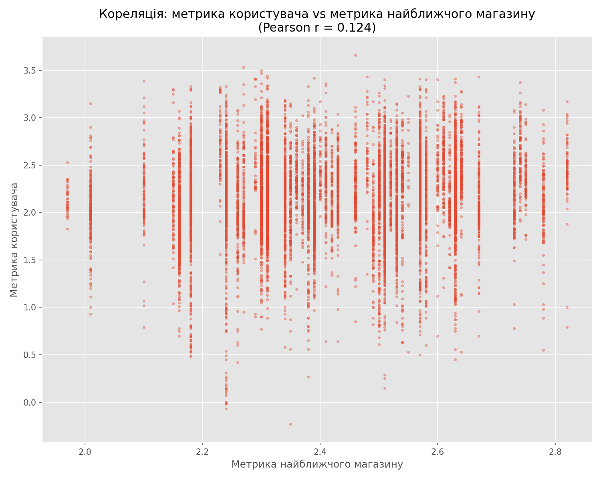
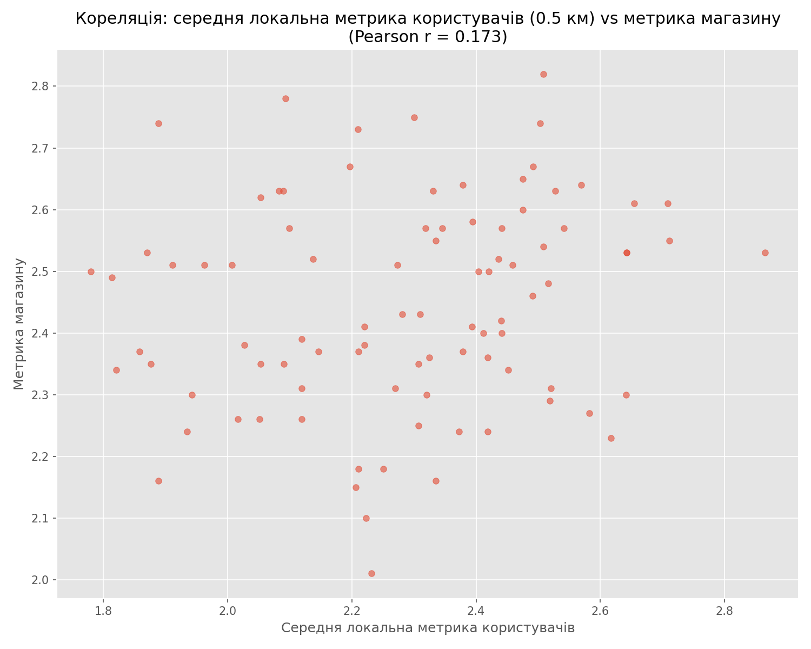
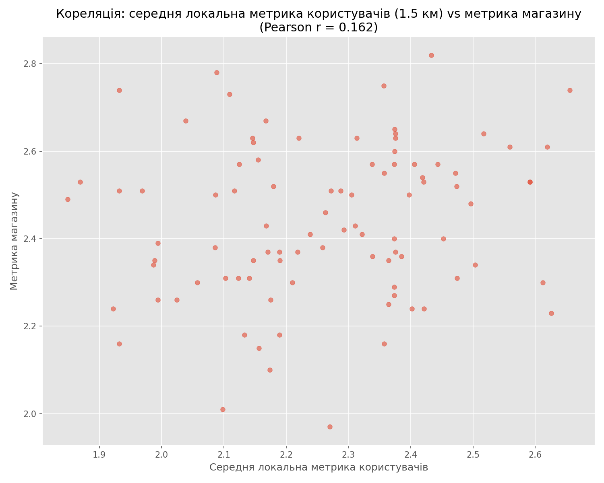

README репозиторію поділено на 2 частини: результати завдання 1 і загальний опис ідей і вирішень в завданнях 2 і 3. Результати завдань 2 і 3 містяться у PBIX файлі. 

Також у репозиторії міститься файл `uv.lock` для відтворення середовища із використанням uv.

Для повноти також необхідна папка `data/original`, у якій мають бути файли `Users.csv` та `stores.csv`. Дані цих файлів були взяті із файлу тестового, але не певен чи їх можна викладати у відкритий доступ. 

# Завдання 1

Аналіз виконано у Python, вихідний код у файлі `correlation.py`

Загалом розглянуто 2 види кореляції:
## Кореляція найближчих користувачів і магазинів

Кореляція слабка позитивна, загалом можемо сказати що користувачі із вищою метрикою перебувають ближче до магазинів із вищою метрикою, але кореляція занадто слабка аби робити якісь висновки

## Кореляція магазинів і середнього користувача у радіусі

Розглянуто 2 варіанти -- близькі та дальні користувачі, 0.5 км та 1.5 км від магазину відповідно

**0.5 км**

---
**1.5 км**

---

Загалом в обох випадках знову маємо позитивну слабку кореляцію, у випадку із ближчими користувачами вона на 6.7% більша, але обидва результати не підтверджують реальної кореляції між даними метриками.

# Завдання 2 і 3

Візуалізація виконана у PowerBI, репорт є у репозиторії. 

## Завдання 2

Загальна візуалізація доступна у PowerBI на вкладці Users and Stores Map. На ній також добре видно, що 2 знаків після коми в координатах замало для коректної візуалізації на мапі. Візуалізації до завдання 1 наведено у ньому ж.

## Завдання 3

Загальне рішення полягало у отриманні додаткових даних для якумога більшого покриття змінних -- було обрано перелік найважливіших із доступних відкритих даних. На основі них було сформовано набір метрик, на основі яких виконувався вибір локацій -- дані метрики мають плаваючі коефіцієнти впливу, змінюючи які можливо динамічно перераховувати найкращі локації. Кандидатами були обрано клітинки розміром 30 кутових секунд -- у Києві це приблизно 0.6 км2. 

### Додаткові дані 
Для аналізу було додано такі дані із відкритих джерел:

* [Estimated population density per grid-cell](https://hub.worldpop.org/geodata/summary?id=44372)
* [Дані про паркування, у тому числі розміщення майданчиків, їх операторів, обладнання та функціонування на території міста Києва](https://data.gov.ua/dataset/2caf3fb6-d967-418b-b67e-d90d99cf98d6)
* [Дані про місце розміщення зупинок міського електричного та автомобільного транспорту в місті Києві](https://data.gov.ua/dataset/b5503a43-44ca-4676-8c7a-4af084974b1c)
* Дані про розташування супермаркетів у м. Київ, [OpenStreetMap](openstreetmap.org)

### Метрики

На основі цих даних було створено декілька метрик:

* Demand -- попит, побудований на базі даних про наявних клієнтів і даних щодо населення. Для змішування цих двох даних обрано наступну формулу:

   * $Demand_{blended​}=α(n)⋅UsersDecay+(1−α(n))⋅Population​$
   * $α(n)=n/(n+k​​)$, де:

        * UsersDecay -- decay-weighted mean значення нормалізованої користувацької метрики, $λ=0.7км$
    
        * $α$ -- коефіцієнт впливу існуючих користувачів, де $n$ - кількість користувачів    
    
        * $k​​$ -- знаходиться шляхом розрахунку $Demand_{blended​}$ для ячейок у яких є магазини із різними $k$, із метою максимізувати кореляцію $Demand_{blended​}$ та метрики магазинів

* Parking -- доступність **офіційно зареєстрованих** паркомісць на парковках поруч. Оцінюються місця в радіусі 100, 200 та 300м.

* Transit -- доступність громадського транспорту, базується на оцінці зупинок громадського транспорту та виходів зі станцій метро. Наразі станції громадського мають вагу 1 проти 4 у виходу зі станції метро, але враховуючи кількість виходів на деяких станціях можливо варто було би підняти вагу на одну станцію але розподілити її порівну по усіх виходах. Розглядаються радіуси 100, 250 і 500м.

* Competition -- кількість інших супермаркетів навколо, базується на даних OpenStreetMap. Розглядаються відстані 500, 1000 та 1500м. В розрахунку використовується інверс, тому що для нас менше - краще.

* Whitespace -- відстань до найближчого супермаркету, базується на даних OpenStreetMap. Знову ж таки розглядаємо інверс.

Для усіх метрик відстані та коефіцієнти для кожного радіусу можна змінити у `cfg.json`.

На базі цих коефіцієнтів будується фінальний скор, шляхом множення метрик на їх оціночний коефіцієнт впливу та додавання. В результаті маємо оцінку ячейки від 0 до 1. 

### PowerBI

У PowerBI звіті на вкладці `Top 15 Locations` можемо побачити карту, на якій буде підсвічено 15 найкращих локацій згідно поточного рейтингу. Для зміни впливу кожної із метрик є 5 слайсерів, на яких можна виставити коефіцієнти від 0 до 1. Імплементувати обмеження суми 5 слайсерів до 1 не вважав доцільним в рамках тестового, тому можна накрутити сумарний коеф вище 1, що фактично ні на що не впливає. Для наочності також є funnel chart з відсотковим впливом кожного фактору на загальний. При зміні факторів можна помітити зміну обраних локацій. Наприклад, якщо дати всі 100% вайтспейсу -- нам видасть найдальші точки від будь-яких магазинів, на самій околиці міста. Мною було обрано коефіцієнти Demand 50%, Parking 5%, Transit 20%, Competition 20% та Whitespace 5%.

На вкладці `Metrics Heatmap` можна подивитись на хітмапу окремих метрик, в даному випадку для позитивних метрик (Demand, Parking, Transit) маємо градієнт від білого (погано) до червоного (добре), для негативних (Сompetition, Whitespace) маємо зворотній градієнт. Наразі присутній баг -- переключення між метриками можливе, лише якщо на слайсері спочатку обрати Demand, а потім бажану метрику. Вважаю що для тестового це не критично.